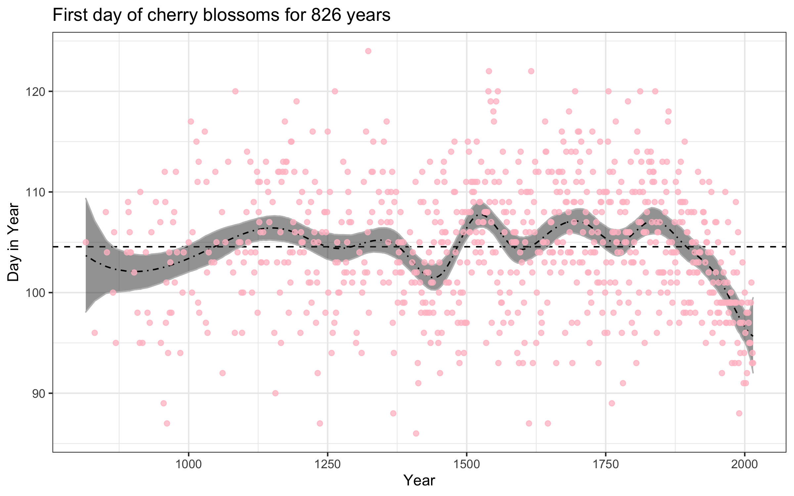

```{r LoadLib, echo = FALSE, eval = TRUE, message=FALSE, warning=FALSE, results = "hide"}
set.seed( 05042021 )
library(tidyverse)
library(printr)
knitr::opts_chunk$set(cache=TRUE, autodep=TRUE, cache.comments=TRUE)
cores <- parallel::detectCores() - 1
## xaringan::inf_mr('27_modernBayesianWorkflow.Rmd')
## str(knitr::opts_chunk$get())
```

<!-- open up etext as you go. don't typeset the chapter -->

# i. Week 15 Focus

- Students receive and act on Ch.13,14 feedback.
- Discuss a modern, simulation-based workflow for Bayesian time series modeling.
- Students apply computational methods to real world data (Final Exam/Poster).

## Today's plan

i. Ch.13,14 HW feedback
ii. Bayesian modeling of 1000 years of cherry blossoms

*Please contribute questions and comments*

## Ch.13,14 HW general feedback

- 13.3 Efficient implementation a high dimension, computationally intense procedure.
- 13.4 Computing critical values for a nonstandard statistical procedure. Hint: work with the difference and find 1D root. Note the function is well defined for $|a|=k$.
- 13.5 Computing critical values for a nonstandard statistical procedure II. Hint: connect to your answer from 13.4 by noticing the distribution functions appearing in the equation. How can you represent this in terms of CDFs? Then the calculation will be trivial.
- 14.1 Use the *simplex* algorithm to solve a small system of equations. Use `boot::simplex()`.

# 1 – Introduction

## Today we'll fit Bayesian time series models

```{r showSplinePlot, echo=F, out.width = '80%', fig.align='center'}

```

## Student learning outcomes

(I hope) that you'll be able to...  

- Formally describe Bayesian time series models.  
- Understand how/why to fit Bayesian models using `stan` and `R`.  
- Understand how/why to use simulation to specify priors.  
- Understand how/why to simulate to from predictive posterior distributions.  
- Compare models using predictive performance.  

## Software used 

- Mostly the excellent `rethinking` R package [@McElreath2020] that occupanying the textbook [Statistical Rethinking](https://xcelab.net/rm/statistical-rethinking/).  
- `rethinking` is a very convenient suite of functions for Bayesian inference that uses/works well with the Hamiltonian Monte Carlo - based software [`stan`](https://mc-stan.org/).  
- The way you specify a model in `rethinking` is essential the same way you would write it down in prose.   

# 2 -- Background

## Bayes rule

- Bayesian rule is a powerful restatement of conditional probability:

$$
  P(\theta | data) = \frac{P(data | \theta) P(\theta)}{\int_\Omega P(data | \theta) P(\theta) d\theta}
$$

- Parameters are not fixed for Bayesians. We are uncertain of their values, and so we (must) regard probability as the "the way" to reason with them [@Jaynes2003; @Lindley2000].
- We learn through Bayes rule, by combining prior knowledge with the data being analyzed, we obtain our updated belief
- "the posterior is proportional to the prior times the likelihood":

$$\pi(\theta \vert data) \propto \pi(\theta) \times \pi(data \vert \theta)$$.

## Bayesian regression

- Regression amounts to defining a surface plus noise.  
- By specifying a conditional mean (conditional on the fixed covariate values), we can build a regression model.
- Below is one way to describe a simple linear model with constant error:

$$
\begin{split}
y_i &\sim \mathcal{N}( \alpha + \beta x_i , \sigma ) \\
\alpha &\sim p(\alpha) \\
\beta &\sim p(\beta) \\
\sigma &\sim p(\sigma) \\
\end{split}
$$

## Sampling the posterior

$$
\pi(\theta | data) = \frac{\pi(data | \theta) \pi(\theta)}{\int_\Omega \pi(data | \theta) \pi(\theta) d\theta}
$$

- The denominator is a constant scale factor that ensures $\pi(\theta|data)$ is a proper probability distribution
  - We often say that the posterior is proportional to the prior times the likelihood: $\quad \pi(\theta | data) \propto \pi(\theta) \times \pi(data | \theta)$
- Often the integral in the denominator is complex or of a high dimension
- A solution is to use **Markov Chain Monte Carlo** (MCMC) simulations to draw samples from the posterior distribution

## Prediction for model comparison

- The problem with parameters: more params **overfit** to sample.
- Instead, look for the **regular** features by estimating out-of-sample predictive performance.
- It is straightforward to make predictions given a posterior by computing the (log) posterior predictive distribution using the $S$ Monte Carlo samples:  

$$
\mathrm{lppd}(y, \Theta) = \sum_i \log \frac{1}{S} \sum_s p(y_i | \Theta_s)
$$

- Bayesian leave-one-out cross validation (**loo-cv**):

$$
\mathrm{lppd}_{CV} = \sum_i \frac{1}{S} \sum_s \log p(y_{i} | \theta_{-i,s})
$$

# 3 - `cherry_blossoms` data set

## A thousand years of cherry blossom data

People in Japan have been recording cherry blossom timings antd climate data for over 1000 years, from 801 - 2015, in our data set below.

```{r data, eval=T}
library(rethinking)
data(cherry_blossoms)
d <- cherry_blossoms
precis(d)
d2 <- d[ complete.cases(d$doy) , ] # complete cases on doy
n <- nrow(d2)
d2$doy1 <- c( NA,  d2$doy[-n] ) # add a lag
d2 <- d2[ -1, ] ## for model comparison later
```

## `doy`: first day of blooms 

```{r doyPlot, echo = F, fig.align = 'center'}
p <- d2 %>% ggplot( aes(x = year, y = doy) ) +
    geom_hline( yintercept = mean(d2$doy), linetype = 'dashed' ) +
    geom_point(color = 'pink', alpha = 0.75) +
    labs(x = "Year", y = "Day in Year", title = paste0("First day of cherry blossoms for ", nrow(d2), " years") ) +
    theme_bw()
p
```

# 4- Modeling the first day of blooms

## Model 0 SLR 

$$
\begin{split}
y_i &\sim \mathcal{N}( \alpha + \beta*year_i , \sigma ) \\
\alpha &\sim N(100, 10) \\
\beta &\sim N(0, 0.1) \\
\sigma &\sim Exponential(1) \\
\end{split}
$$


```{r m0, results='hide'}
m0 <- ulam(
    alist(
        y ~ dnorm( mu, sigma ) ,
        mu <- a + b*year ,
        a ~ dnorm(100, 10) ,
        b ~ dnorm(0, 0.1),
        sigma ~ dexp(1)
    ) , data = list( y=d2$doy, year=d2$year),
    log_lik = T)
```

## Prior predicitve checks

```{r priorPredictiveM0, results='hide', out.width='50%', fig.align='center'}
## prior predictive checks
prior <- extract.prior( m0 )
plot( NULL, xlim = range(d2$year),
     ylim= c(50, 150), xlab="Year", ylab="Lines Sampled from the Prior Predictive" )
N <- 100
for (i in 1:N ) {
    curve( prior$a[[i]] + prior$b[[i]]*x ,
          from = min(d2$year), to = max(d2$year), add = T ,
          col = col.alpha( "black", 0.2 ) )
}
```

## Posterior mean prediction

```{r extractM0}
## precis( m0 )
post <- extract.samples( m0 )
mu <- link( m0 )
mu_PI <- apply( mu, 2, PI, 0.89 )
d3 <- data.frame( m0_mean = colMeans(mu), m0_lower = mu_PI[ 1, ], m0_upper = mu_PI[ 2, ] ) 
d3 <- cbind( d2, d3 )
```

## Model 0 SLR mean estimation

```{r m0Plot, echo = F, fig.align = 'center', warning=F}
p0 <- d3 %>% ggplot( aes(x = year, y = doy) ) +
    geom_hline( yintercept = mean(d3$doy), linetype = 'dashed' ) +
    geom_point(color = 'pink', alpha = 0.5) +
    geom_ribbon(data = d3, aes( ymin = m0_lower, ymax = m0_upper), color = "blue", alpha = 0.3 ) +
    geom_line(aes( y = m0_mean ), color = 'blue', alpha = 0.5)  +
    labs(x = "Year", y = "Day in Year", title = paste0("First day of cherry blossoms for ", nrow(d3), " years") ) +
    theme_bw()
p0
```

## Model 0 Posterior predictions

```{r ppcheckM0}
mu <- link( m0 )
mu_PI <- apply( mu, 2, PI, 0.89 )
D_sim <- sim( m0, n = 500 )
D_PI <- apply( D_sim, 2, PI, 0.89 )
```

## Model 0 Posterior predictions

```{r ppcheckM0plot, echo=F, eval=T}
## prior predictive checks
N <- 6
par( mfrow =  c(2, 3) ) 
for (i in sample( nrow(D_sim) , size = N) ) {
    plot( x=d2$year, y = d2$doy , xlim = range(d2$year),
         ylim= range(D_sim), xlab="Year", ylab="Posterior Predictive draws",
         col = col.alpha( "pink", 0.5 ), pch = 19)
    points( x=d2$year, y = D_sim[i, ], col = col.alpha('lightblue', 0.75) )
}
```


## Model 1 AR(1)

$$
\begin{split}
y_i &\sim \mathcal{N}( \alpha + \beta * y_{i-1}, \sigma ) \\
\alpha &\sim N(100, 10) \\
\beta &\sim N(0, 10) \\
\sigma &\sim Exponential(1) \\
\end{split}
$$


```{r m1, results='hide'}
m1 <- ulam(
    alist(
        y ~ dnorm( mu, sigma ) ,
        mu <- a + b*doy1,
        a ~ dnorm(100, 10) ,
        b ~ dnorm(0, 10),
        sigma ~ dexp(1)
    ) , data = list( y=d2$doy, doy1=d2$doy1),
    log_lik = T)
```

## Model 1 AR(1) prior predictives

```{r priorPredictiveM1, eval=T, include=T, results='hide', out.width='50%', fig.align='center'}
## prior predictive checksp
prior <- extract.prior( m1 )
N <- 100
ySim <- sapply( 1:N, function(k) ( prior$a[k] + prior$b[k]*d2$doy1 ) )
plot( NULL, xlim = range(d2$year),
     ylim= range(ySim), xlab="Year", ylab="Lines Sampled from the Prior Predictive" )
for (i in 1:N ) {
    lines(x = d2$year, y = ySim[, i],
          col = col.alpha( "black", 0.2 ) )
}
```

## Model 1 AR(1) prior predictives

Try more informative prior:

```{r m1.1, eval=T, include=T, results='hide'}
m11 <- ulam(
    alist(
        y ~ dnorm( mu, sigma ) ,
        mu <- a + b*doy1,
        a ~ dnorm(100, 5) ,
        b ~ dnorm(0, 0.5),
        sigma ~ dexp(1)
    ) , data = list( y=d2$doy, doy1=d2$doy1),
    log_lik = T)
```

## Model 1 AR(1) prior predictives

```{r priorPredictiveM1.1, eval=T, include=T, results='hide', out.width='50%', fig.align='center'}
## prior predictive checks
prior <- extract.prior( m11 )
## vizualize
N <- 100
ySim <- sapply( 1:N, function(k) ( prior$a[k] + prior$b[k]*d2$doy1 ) )
plot( NULL, xlim = range(d2$year),
     ylim= range(ySim), xlab="Year", ylab="Lines Sampled from the Prior Predictive" )
for (i in 1:N ) {
    lines(x = d2$year, y = ySim[, i],
          col = col.alpha( "black", 0.2 ) )
}
```

## Model 1 AR(1) posterior mean

```{r extractM1}
precis( m11)
post <- extract.samples( m11 )
mu <- link( m11 )
mu_PI <- apply( mu, 2, PI, 0.89 )
d4 <- data.frame( m1_mean = colMeans(mu), m1_lower = mu_PI[ 1, ], m1_upper = mu_PI[ 2, ] )
d4 <- cbind( d3, d4 )
```

## Model 1 AR(1) posterior mean

```{r m1Plot, echo = F, fig.align = 'center', warning=F}
p1 <- d4 %>% ggplot( aes(x = year, y = doy) ) +
    geom_hline( yintercept = mean(d4$doy), linetype = 'dashed' ) +
    geom_ribbon(data = d4, aes( ymin = m1_lower, ymax = m1_upper), color = "grey", alpha = 0.5 ) +
    geom_point(color = 'pink', alpha = 0.55) +
    ## geom_line(aes( y = m1_mean ), color = 'black', alpha = 1, linetype = "dotdash")  +
    labs(x = "Year", y = "Day in Year", title = paste0("First day of cherry blossoms for ", nrow(d4), " years") ) +
    theme_bw()
p1
```

## Model 1 AR(1) posterior predictions

```{r ppcheckM11}
mu <- link( m11 )
mu_PI <- apply( mu, 2, PI, 0.89 )
D_sim <- sim( m11, n = 500 )
D_PI <- apply( D_sim, 2, PI, 0.89 )
```

## Model 1 AR(1) posterior predictions

```{r ppcheckM11plot, echo=F, eval=T}
## prior predictive checks
N <- 6
par( mfrow =  c(2, 3) ) 
for (i in sample( nrow(D_sim) , size = N) ) {
    plot( x=d2$year, y = d2$doy , xlim = range(d2$year),
         ylim= range(D_sim), xlab="Year", ylab="Posterior Predictive draws",
         col = col.alpha( "pink", 0.5 ), pch = 19)
    points( x=d2$year, y = D_sim[i, ], col = col.alpha('lightblue', 0.75) )
}
```

## Model 2 Splines

The likelihood:

$$
\begin{split}
D_i &\sim \mathcal{N}( \mu_i , \sigma ) \\
\mu_i &= \alpha + \sum_{k=1}^K w_k B_{k,i}\\ 
\end{split}
$$

With priors:  

$$
\begin{split}
\alpha &\sim N(100, 10) \\
w_j &\sim N(0, 10) \\
\sigma &\sim Exponential(1) \\
\end{split}
$$

## Preprocessing for Model 2 Spline

```{r preprocessM2}
num_knots <- 15
knot_list <- quantile( d4[ , "year"], probs = seq( 0, 1, length.out = num_knots ) )
library(splines)
B <- bs( d4[ , "year"],
        knots = knot_list[ -c(1, num_knots) ],
        degree = 3, intercept = TRUE )
```

## Preprocessing for Model 2 Spline

```{r plotSplines}
plot ( NULL, xlim=range(d4[ , "year"]), ylim = c(0,1), xlab="year", ylab="basis")
for (i in 1:ncol(B) ) lines( d4[ , "year"], B[ ,i ] )
```

## Model 2 splines fitting

```{r m2}
m2 <- quap(
    alist(
        D ~ dnorm( mu, sigma ) ,
        mu <- a + B %*% w,
        a ~ dnorm(100, 10) ,
        w ~ dnorm(0, 10),
        sigma ~ dexp(1)
    ) , data = list( D=d4$doy, B = B ) ,
    start = list( w = rep( 0, ncol(B) ) ) )
```

## Model 2 splines fitting

```{r extractM2}
precis( m2 )
post <- extract.samples( m2 )
mu <- link( m2 )
mu_PI <- apply( mu, 2, PI, 0.89 )
d5 <- data.frame( m2_mean = colMeans(mu), m2_lower = mu_PI[ 1, ], m2_upper = mu_PI[ 2, ] )
d5 <- cbind( d4, d5 )
```

## Model 2 splines posterior mean

```{r m2Plot, echo = F, fig.align = 'center', warning=F}
p2 <- d5 %>% ggplot( aes(x = year, y = doy) ) +
    geom_hline( yintercept = mean(d5$doy), linetype = 'dashed' ) +
    geom_ribbon(data = d5, aes( ymin = m2_lower, ymax = m2_upper), color = "grey", alpha = 0.5 ) +
    geom_line(aes( y = m2_mean ), color = 'black', alpha = 1, linetype = "dotdash")  +
    geom_point(color = 'pink', alpha = 0.75) +
    labs(x = "Year", y = "Day in Year", title = paste0("First day of cherry blossoms for ", nrow(d5), " years") ) +
    theme_bw()
p2
ggsave("splineMean.png", plot = p2, width = 8, height = 5)
```

## Posterior predictions simulations from M2 Spline

- Simulated data sets
- observation uncertainty, as opposed to conditional mean uncertanity

```{r ppcheckM2}
mu <- link( m2 )
mu_PI <- apply( mu, 2, PI, 0.89 )
D_sim <- sim( m2, n = 1e4 )
D_PI <- apply( D_sim, 2, PI, 0.89 )
```

## Posterior predictions from M2 Spline

```{r ppcheckM2plot, echo=F, eval=T}
## prior predictive checks
N <- 6
par( mfrow =  c(2, 3) ) 
for (i in sample(1e4, size = N) ) {
    plot( x=d2$year, y = d2$doy , xlim = range(d2$year),
         ylim= range(D_sim), xlab="Year", ylab="Posterior Predictive draws",
         col = col.alpha( "pink", 0.5 ), pch = 19)
    points( x=d2$year, y = D_sim[i, ], col = col.alpha('lightblue', 0.75) )
}
```

# 5 - Model comparison through predictive preformance

## Using PSIS-estimate of `loo`

Rather than fitting `n` models to estimate the loo-cv error, you can use a Pareto Smoothed Importance Sampled estimate [@Vehtari2016a].

```{r psis}
compare( m0, m1, m11, m2, func=PSIS )
```

<style>
slides > slide { overflow: scroll; }
slides > slide:not(.nobackground):before {
  background: none;
}
</style>

## Future work/other models to consider

- Gaussian process using time separation to define covariance

```{r preprocessM3, eval=F, echo=F}
pairMat <- combn( x = d5$year, m = 2 )
allDiffs <- apply( pairMat , 2, diff ) 
## allDiffs <- apply( pairMat , 2, diff ) / diff( range(d5$year) )
summary(allDiffs)
dmat <- matrix( data = NA, nrow = nrow(d5), ncol = nrow(d5) )
dmat[upper.tri(dmat)] <- allDiffs
dmat[ 1:5, 1:5 ]
```

## Questions? and References

*I'm glad to answer any questions while I display the references.*
